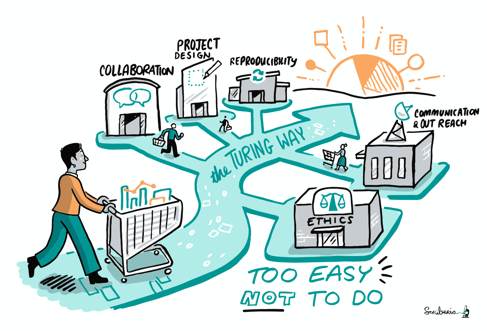
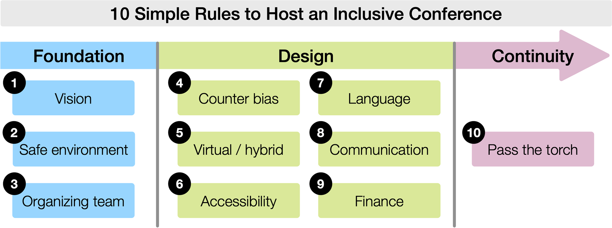

```{r metadata, echo=FALSE}
# creating HTML metadata to accompany the slides
# metathis package documentation: https://pkg.garrickadenbuie.com/metathis/

library(metathis)
meta() %>%
  meta_general(
    description = "Presentation Title",
    generator = "xaringan and remark.js"
  ) %>% 
  # GitHub repo housing the slides for the talk
  meta_name("github-repo" = "LizHareDogs/btsCon2024") %>%
  # metadata for the social card that appears when you share the link on social media
  meta_social(
    title = "BTScon 2024 | Liz Hare, PhD",
    url = "slide url",
    image = "coverImageSlide.png",
    image_alt = "",
    og_type = "website",
    og_author = "Liz Hare")
  
```

```{r xaringanthemer, echo=FALSE, warning=FALSE}
library(xaringanthemer)

# creating a custom CSS stylesheet using xaringanthemer
# xaringanthemer package documentation: https://pkg.garrickadenbuie.com/xaringanthemer/reference/style_duo_accent_inverse.html

style_duo_accent_inverse(
  primary_color = "#C6B78A",   # gold color from the logo (headers, inverse slides)
  secondary_color = "#C6B78A", # gold color (links and bold words)
  white_color = "#F5F5F5", # off-white color (text)
  black_color = "#14213D", # dark navy blue color (slide background)
  base_font_size = "25px",
  header_h1_font_size = "2.75rem",
  header_h2_font_size = "2.25rem",
  header_h3_font_size = "1.75rem",
  link_decoration = "underline",
  table_row_even_background_color = "#313C54", # lighter navy color
  inverse_link_color = "#14213D", # dark navy blue color
  code_highlight_color = "#ECECCE", # beige color
  header_background_content_padding_top = "5rem",
  footnote_position_bottom = "40px",
  outfile = "css/xaringan-themer.css",
  text_font_family = "Atkinson Hyperlegible",
  text_font_google = google_font("Atkinson Hyperlegible"),
  header_font_google = google_font("Atkinson Hyperlegible"),
  extra_css = list(
    # the following css styles the horizontal bars
    "hr" = list("color" = "#C6B78A",
                "content" = "''",
                "display" = "block",
                "border" = "none",
                "background-color" = "#C6B78A",
                "height" = "0.08em"),
    # the following css styles the list markers to apply the primary color
    "li::marker" = list("content" = "&#8226;",
                        "color" = "#C6B78A"))
)
```

```{r xaringanExtra, echo=FALSE, warning=FALSE, message=FALSE}
library(xaringanExtra)

# specifying xaringanExtra features
# xaringanExtra package documentation: https://pkg.garrickadenbuie.com/xaringanExtra/#/?id=xaringanextra

xaringanExtra::use_xaringan_extra(
  c("tile_view",   # enables an overview of the slide deck using letter "O"
    "slide_tone"   # enables audible tone for slide transitions
    )
  ) 
```


```{r setup, include=FALSE, eval = TRUE}
# loading libraries
library(fontawesome)    # icons for use alongside contact info

# turning off scientific notation
options(scipen = 999)

# setting knitr code chunk options
knitr::opts_chunk$set(collapse = TRUE,
                      fig.retina = 3,
                      cache = FALSE,
                      warning = FALSE,
                      message = FALSE,
                      echo = FALSE,
                      comment = NA,
                      dpi = 300,
                      fig.align = "center")
```


class: middle, title


### `r rmarkdown::metadata$title`
--- 

.pull-left[
#### `r rmarkdown::metadata$subtitle`
]

.pull-right[
#### `r rmarkdown::metadata$author` 
<br> [`r fa("github", a11y="sem")` @LizHareDogs](https://github.com/LizHareDogs)<br>
[`r fa("mastodon", a11y="sem")` @LizHare](https://fosstodon.org/@lizhare) <br>
[`r fa("envelope", a11y="sem")` LizHare@DogGenetics.com](mailto:LizHare@DogGenetics.com)
]


---

### Why would I rather talk about science?

* Dog science is way more interesting to me
* Inclusion is often an uncomfortable topic for an audience
* Sometimes I have to confront people about their biases even more than in regular life
* I *don't get paid* for most of this work.


---

### Some cringey stereotypes 

Cultural stories we tell about people who advocate for inclusion:

* One-dimensional
* Unqualified 
* Overentitled 
* Attention-seeking

---

class: middle, center

### No Advocacy = No Progress


---

class: middle, center

### What does 'accessibility' mean?

---


### The Turing Way

.pull-left[
[The Turing Way](https://book.the-turing-way.org) is an always-evolving, online book and community with guides to open science topics:
* Project design
* Reproducibility
* Collaboration
* Communication
* Ethical research
]

.pull-right[
``` {r, fig1, eval=TRUE, echo=FALSE, fig.alt="The Turing Way project is illustrated as a road or path with shops for different data science skills, drawn in a blue, yellow, and black color scheme. A person is holding a shopping cart full of charts and graphs, pushing on a path that splits down five paths that represent The Turing Way guides: 	Collaboration, Project Design, Reproducibility, Ethnics, and Communication & Outreach. People holding shopping bags and pushing carts are going between the different guides. The path is pointing towards a sun in the shape of a graph, and under it reads the phrase 'Too Easy Not to Do'. ."}

```
]

What better place to help open science communities learn about practices for inclusion and accessibility?

---

### The Turing Way Accessibility Definition

* Accessibility policy in development
* Discussion about what accessibility means in an open science community of practice
* Share your insight and suggestions in [this GitHub issue](https://github.com/the-turing-way/the-turing-way/issues/3145)
---


### The Turing Way Accessibility Policy in Words

> a set of community-wide, behavioural, social, and technical decisions that can be taken to ensure that all are welcome and are able to enter and participate in research, data-driven processes, communities and events despite any barriers for access.

> While accessibility is commonly understood with respect to disability, we – meaning _The Turing Way_ community – define accessibility as giving access to everyone, with specific attention given to ensuring proper access for groups of people that encounter different barriers for participation. Barriers may be anything related to, including, and extending beyond the following...

---

### The Turing Way Accessibility Policy Applies to


.pull-left[
* Age
* Disability
* Ethnicity and race
* Family
* Language (written and/or spoken)
* Geography
]

.pull-right[
* Nationality
* Religion, faith and belief
* Sex and gender
* Sexual orientation
* Socioeconomic status
* Technical or disciplinary background
]

---

class: middle, center

### How do we implement inclusion?


---

class: top

### Ten Simple Rules to Host an Inclusive Conference

.pull-left[
[article](https://journals.plos.org/ploscompbiol/article?id=10.1371/journal.pcbi.1010164) 
published after organizing [UseR!2021](https://user2021.r-project.org).

These rules can be applied more broadly to open science communities where people collaborate synchronously and asynchronously.
]

.pull-right[

``` {r, fig2, eval=TRUE, echo=FALSE, fig.alt='Diagram of the 10 rules organized into 3 groups: foundation rules (Rules 1 to 3), design rules (Rules 4 to 9), and a continuity rule (Rule 10). The overall diagram depicts an arrow from left to right containing all the rules. In the left column, under the first label “Foundation,” there are 3 text boxes in light blue: “1. Vision,” “2. Safe environment,” and “3. Organizing Team.” In the middle column, under the label “Design Rules” there are 6 light green boxes with Rules “4. Counter bias,” “5. Virtual/hybrid,” “6. Accessibility,” “7. Language,” “8. Communication,” “9. Finance.” To the right, below the arrowhead labeled “Continuity,” is the 10th Rule in a light pink box “10. Pass the torch.”'}

```
]


---

### 1. Foundation: Set a vision for diversity and inclusion

"... some groups of people have been systematically excluded from or only partially included in academic, scientific, and professional circles. Recognizing this systematic exclusion is paramount to inclusion."

What you can do:
* Assess what who is excluded or marginalized in your field.
* Decide and explain to the community what inclusion means
* Refer back to these expectations for diversity as you plan, hold, and evaluate your event

---

### 2. Foundation: Create a safe and welcoming environment

What this means:
* Engage with participants you included in your vision for inclusion
* Implement a code of conduct to support all participants
* Encourage bystanders to actively support people in case anything unpleasant, inappropriate, or offensive happens.

---

### 3. Foundation: Gather a diverse and inclusive organizing team

"Nothing about us without us"

Engage the expertise of people from marginalized groups to create a welcoming, barrier-free environment.

But:
* Don't force marginalized people to work (only) on DEI-- they must be included in all aspects of planning.
* Consider how you can compensate people who are chronically expected to do this work


---

### 4. Design: Consciously counteract bias in the conference program

Avoid the "usual suspects!" -- invite keynotes and hosts from various backgrounds rather than repeatedly inviting the same people who usually have more privelege.

Submission reviewers should be educated about bias.

Consider anonymizing the submission process as much as possible.

Broaden topics and activities to remove biases in favor of particular subfields.

---

### 5. Design: Design a strong online component

Although people are traveling again, there are several reasons not to:

* Environmental impact of travel
* Expense-- only the most privileged have the opportunity to travel, so conferences become elite-only clubs
* Many countries have discriminatory visa practices


---

### 6. Design: Make the conference accessible to people with disabilities

Chicken-and-egg problem: we haven't been visible because we haven't had good access

Early planning for accessibility saves time and money.

Examples of accessibility practices:
* Ensuring physical accessibility of venue and social events to wheelchair users
* Captions
* Platform, schedule, and website accessibility for screen reader users
* Adding alternative text descriptions for images
* Have an accessibility policy for talks and encourage accessible slide formats
* Communicating on your website what accessibility practices you'll be implementing
* Ensure the tools used for planning and organizing the conference are accessible.

---

### 7. Design: Make room for the linguistic diversity of your community

How to beat the English bias:
* Allow submissions and presentations in multiple languages
* Judge submissions by the content and work rather than English proficiency
* Hold social events in multiple languages

---

### 8. Design: Build an inclusive communication strategy

* Use a wide variety of media (email, websites, communities of practice, and social media) to announce your conference and reach out to groups that have been excluded
* Publish diversity statement, code of conduct, accessibility policy and related information so it can be found easily by potential participants
* Provide a point of contact for questions about financial assistance and accessibility practices
* Promote all speakers equally when featuring them during the conference and on social media

---


### 9. Design: Allocate adequate financial resources to support inclusion goals

Budget for things like
* Compensating organizers
* Scholarships or reduced fees depending on socioeconomic categories
* Accessibility-related costs like accurate captioning


---

### 10. Continuity: Make the conference part of a long term process for inclusion

* Review goals for inclusiveness from Step 1 and evaluate whether they were met
* Feedback from participants should be documented and made public so knowledge won't be lost before the next conference 
* Based on experience and feedback, set new standards for the next conference

---

### The Turing Way Accessibility Working Group

* Works on accessibility policy
* Creates guides for accessible communication (Slack)
* Adapts to using new collaboration tools across the community for increased accessibility
* Consults on event organization, troubleshooting and suggesting accessibility practices
* Advocates and addresses biases

---

class: middle, center

### The social part


---

class: top

### Social interaction

* Focus on welcoming people without barriers
* Remove as many barriers as you can without forcing people to disclose their status
    * Organizers are *not the disability police*!
	* Many disabilities and identities are not visible
* When talking about groups of people, use the language accepted by the individual or group
* Use matter-of-fact language about disability (e.g. blind, deaf, autistic)
	* Avoid euphemisms ("____ challenged", "special")
    * [I'm Not Your Inspiration, Thank You Very Much](https://www.youtube.com/watch?v=8K9Gg164Bsw) TED talk by Stella Young	
	* Avoid portraying us as inherently "needy." The *community needs* to be accessible.

---

### Ask questions! 

* if you don't ask, you might end up excluding someone
* Put answers where people can find them independently-- then they can focus on *talking about science*


---


#### Thank you! 

* BTSCon organizers
* Colleagues at The Turing Way
* UseR!2021 Organizing Committee


